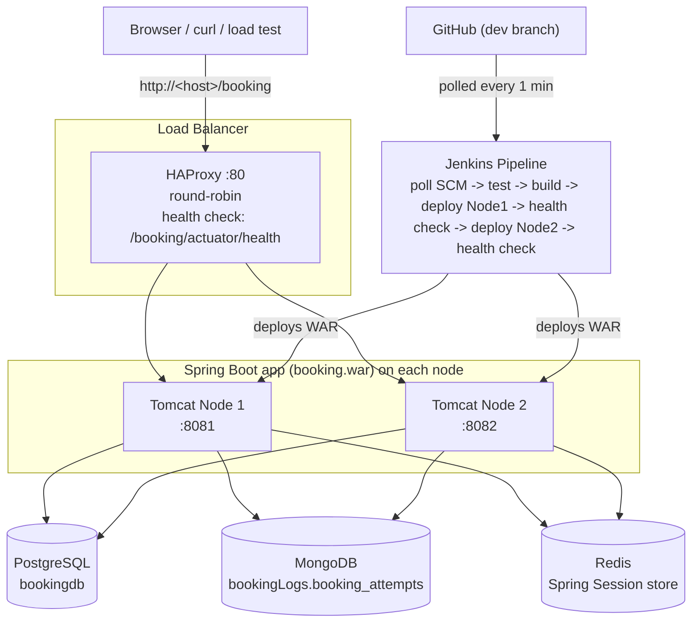
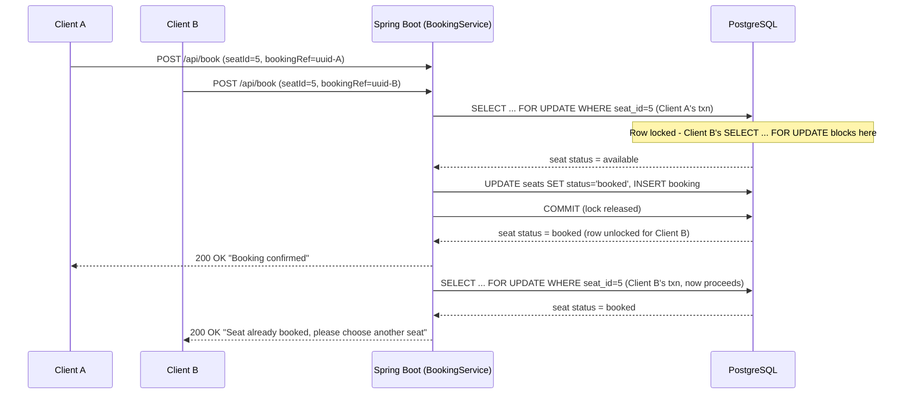

# Concurrent Ticket Booking System

Race-condition-safe movie/event ticket booking system demonstrating transaction isolation, distributed session handling, and idempotency under concurrent load.

- PostgreSQL row-level locking (`SELECT ... FOR UPDATE`)
- Idempotent booking via UUID `booking_ref`
- Redis-backed distributed sessions shared across two Tomcat nodes
- HAProxy load balancing with active health checks
- MongoDB logging of every booking attempt (success and failure)
- Jenkins CI/CD pipeline with rolling, zero-downtime deployment

> **Note on source control:** GitHub was used in place of GitLab. Both provide equivalent DVCS and Merge Request / Pull Request workflows, so all task requirements around branching and code review are still met.

---

## Architecture

Both Tomcat nodes run on the same physical machine (separate `CATALINA_BASE` directories, different ports) to simulate a two-node deployment, since only one machine was available for this task. In a real deployment each node would run on its own host, both listening on port 8080, and HAProxy would route to them over the network instead of `127.0.0.1`.

### Booking request flow (race-condition safety)

---

## Repository Structure

    app/            Spring Boot application source (Java 17, Maven, WAR packaging)
    db/postgres/    PostgreSQL schema.sql and seed.sql
    db/mongo/       MongoDB init script for booking_attempts collection
    redis/          Redis setup + troubleshooting notes
    haproxy/        HAProxy config (haproxy.cfg)
    jenkins/        Jenkins pipeline notes and issues fixed
    load-test/      Concurrent load test script (Python, load_test.py)
    docs/           Proof documents (load test results, session persistence, Tomcat setup)
    Jenkinsfile     CI/CD pipeline definition (repo root)

---

## Step-by-Step Implementation

Each step below links to the detailed documentation and troubleshooting notes captured while building this system.

### 1. Database design - PostgreSQL

    sudo apt install -y postgresql postgresql-contrib
    sudo -u postgres psql -c "CREATE USER booking_user WITH PASSWORD '...';"
    sudo -u postgres psql -c "CREATE DATABASE bookingdb OWNER booking_user;"
    psql -U booking_user -d bookingdb -h localhost -f db/postgres/schema.sql
    psql -U booking_user -d bookingdb -h localhost -f db/postgres/seed.sql

`events`, `seats`, `bookings` tables with `CHECK` constraints on status and a `UNIQUE` `booking_ref` (UUID) for idempotency. See `db/postgres/schema.sql`.

### 2. Booking attempt logging - MongoDB

    curl -fsSL https://pgp.mongodb.com/server-8.0.asc | sudo gpg -o /usr/share/keyrings/mongodb-server-8.0.gpg --dearmor
    echo "deb [signed-by=/usr/share/keyrings/mongodb-server-8.0.gpg] https://repo.mongodb.org/apt/ubuntu noble/mongodb-org/8.0 multiverse" | sudo tee /etc/apt/sources.list.d/mongodb-org-8.0.list
    sudo apt install -y mongodb-org
    mongosh db/mongo/init_booking_logs.js

A known kernel 6.19+ / TCMalloc crash was hit and fixed with a systemd `GLIBC_TUNABLES` override - see `db/mongo/README_mongo_troubleshooting.md`.

### 3. Distributed sessions - Redis

    sudo apt install -y redis-server
    sudo systemctl enable --now redis-server
    redis-cli ping   # PONG

A pre-existing Docker container on port 6379 had to be removed first - see `redis/README_redis_notes.md`.

### 4. Web application - Spring Boot

    cd app
    mvn clean package -DskipTests
    java -jar target/booking.war

Login (session in Redis via Spring Session), event list, color-coded seat map, `BookingService.bookSeat()` with `SELECT ... FOR UPDATE` row locking + idempotency check + MongoDB attempt logging, `/actuator/health` for HAProxy.

### 5. Load test (race-condition proof)

    cd load-test
    python3 load_test.py 5 20

Result: 20 simultaneous requests for one seat -> exactly 1 success, 19 clean "already booked" failures, 0 server errors, exactly 1 row in the `bookings` table. Full output and DB verification in `docs/load_test_results.md`.

### 6. Two Tomcat nodes

    # separate CATALINA_BASE per node, ports 8081 / 8082
    sudo cp app/target/booking.war /opt/tomcat-node1/webapps/booking.war
    sudo cp app/target/booking.war /opt/tomcat-node2/webapps/booking.war
    sudo systemctl enable --now tomcat-node1 tomcat-node2

Setup, permission issues (`203/EXEC`, wildcard-under-sudo) and fixes documented in `docs/tomcat/README_tomcat_notes.md`.

### 7. HAProxy load balancing

    sudo apt install -y haproxy
    # /etc/haproxy/haproxy.cfg - round robin, option httpchk GET /booking/actuator/health
    sudo systemctl enable --now haproxy
    curl http://localhost/booking/actuator/health

Config and stats-page verification in `haproxy/README_haproxy_notes.md`.

### 8. Session persistence proof

Logged in via HAProxy, captured the session ID from `/booking/whoami`, killed `tomcat-node1`, waited for HAProxy to mark it down, hit `/booking/whoami` again through `tomcat-node2` - **identical session ID**, user still logged in. Full transcript in `docs/session_persistence_proof.md`.

### 9. Jenkins CI/CD pipeline

    curl -fsSL https://pkg.jenkins.io/debian-stable/jenkins.io-2026.key | sudo tee /usr/share/keyrings/jenkins-keyring.asc > /dev/null
    echo "deb [signed-by=/usr/share/keyrings/jenkins-keyring.asc] https://pkg.jenkins.io/debian-stable binary/" | sudo tee /etc/apt/sources.list.d/jenkins.list
    sudo apt install -y jenkins
    sudo systemctl enable --now jenkins

Pipeline (`Jenkinsfile`): checkout -> unit tests (including a concurrent-booking test) -> build WAR -> deploy Node 1 -> health check -> deploy Node 2 -> health check -> notify. Triggered by `pollSCM` every minute (no public endpoint available locally for a real GitHub webhook - documented as the production alternative). Signing-key rotation, a sudoers path mismatch, and a curl-retry bug were all hit and fixed - full writeup in `jenkins/README_jenkins_notes.md`.

### 10. GitHub branching

Work happens on `dev`; completed features are merged into `main` via Pull Request rather than direct pushes, per the task's Git workflow requirement.

---

## Proof Points

| Requirement | Evidence |
|---|---|
| 1 success / 19 failures under 20 concurrent requests | `docs/load_test_results.md` |
| Session survives a Tomcat node kill | `docs/session_persistence_proof.md` |
| Dual-node Tomcat + HAProxy health-checked routing | `docs/tomcat/README_tomcat_notes.md`, `haproxy/README_haproxy_notes.md` |
| Jenkins rolling zero-downtime deploy | Jenkinsfile + `jenkins/README_jenkins_notes.md` |

## Access URL

    http://<machine-name>/booking

HAProxy listens on port 80 and forwards to whichever Tomcat node is currently healthy.
